# Advanced Lane Finding

The aim of this project is to detect lanes of arbitrary curvature fairly accurately under any driving conditions.
 

# Camera calibration
First, we need to figure out the characteristics of our camera. In OpenCV we perform camera calibration on a set of 
gray-scale checkerboard images where we first get checkerboard corners and then compute transform. The result of this
calibration is a camera projection matrix and distortion coefficients, that in turn can be used on any image coming out 
of the camera.

The following code is an example how to perform camera calibration:

    ...
    success, corners = cv2.findChessboardCorners(image, (columns, rows), None)

    if success:
        image_points.append(corners)
        object_space_points.append(object_points)
        success, camera_matrix, distortion_coeffcients, rotation_vectors, translation_vectors = cv2.calibrateCamera(object_space_points, image_points, image.shape[::-1], None, None)
    ...

Before and after:

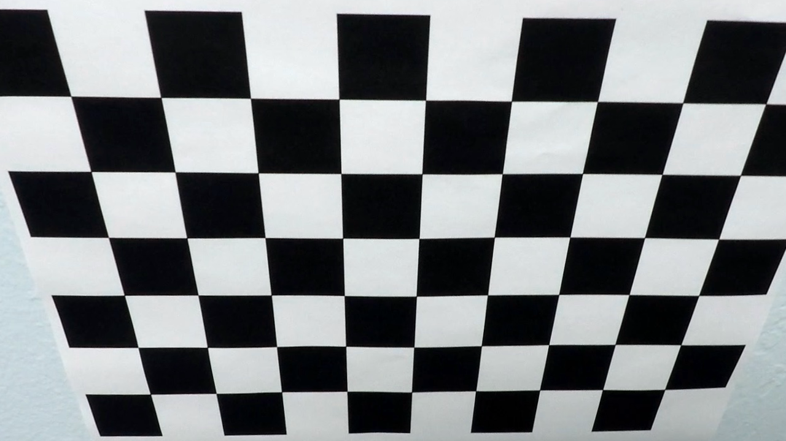

Code performing these operations can be found in [camera](camera.py) source file.

# Image processing pipeline

Each frame of input video goes through an image processing pipeline. In this section this pipeline is described
in detail.

Implementation can be found in [image processing](image_processing.py) source file.

## 1. Distortion correction
First step in our pipeline is to use the camera calibration characteristics on every video frame. You can notice
slightly curved lines in the original frame are straightened after applying distortion correction in the second
image.

Before and after straightening (look especially at a horizontal line near the bottom):

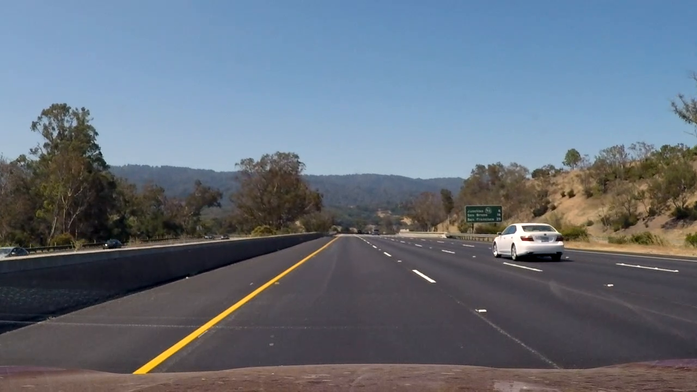

## 2. Gradient mask

Next, we would like to detect computer vision features in our images like lane lines etc. To achieve this, variations
based on [Sobel](https://en.wikipedia.org/wiki/Sobel_operator) operator were used, in particular these three variations:
- Sobel operator applied on x-dimension, allowing detection of vertical components, within a range of (50 - 255) 
and kernel size of 3
- direction angle composed out of Sobel operator applied on both x- and y-axis using arctan, within a range
 of (0.7 rad - 1.3 rad) and kernel size of 3
- magnitude composed out of Sobel operator applied on both x- and y-axis as a simple Euclidean length, within a range
of (60 - 255) and kernel size of 17

Combining pixels that either fall within the range of x-gradient or satisfy both directional and magnitudal range 
are then used as output. Here is an example for our previous image:

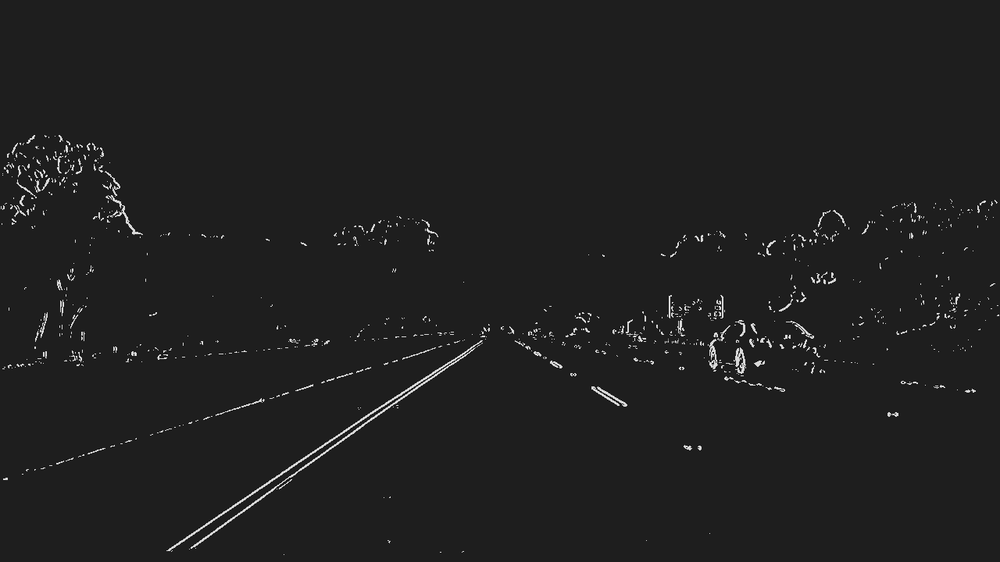

This is fairly good but needs more processing.

## 3. Color mask

To add some more missing information, particularly lanes, we utilize two characteristics 
of [HSL](https://en.wikipedia.org/wiki/HSL_and_HSV) color space. To properly detect inner parts of lanes
we pick pixels whose saturation S-channel lies in between 120 - 255 and whose lightness L-channel
lies in between 30 - 255. The first one allows us to fill inner areas of lanes, the second one allows
us to filter out many instances of shadows on the road.
 
Here is a color mask for our frame:
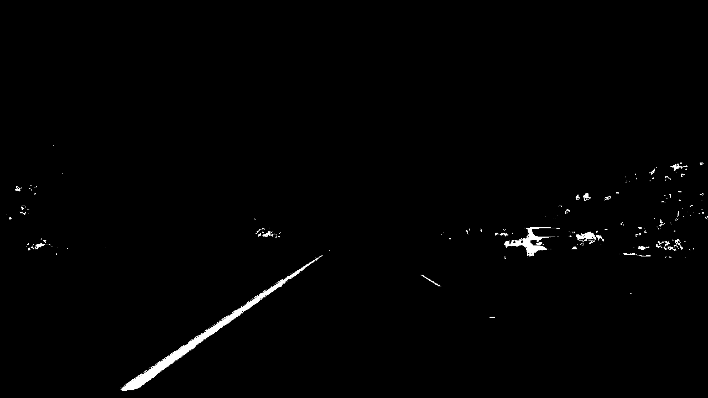

## 4. Combined mask

Finally, we combine both gradient mask and color mask together by picking pixels that are set to 1
in either of these masks. Result for our frame looks as follows:
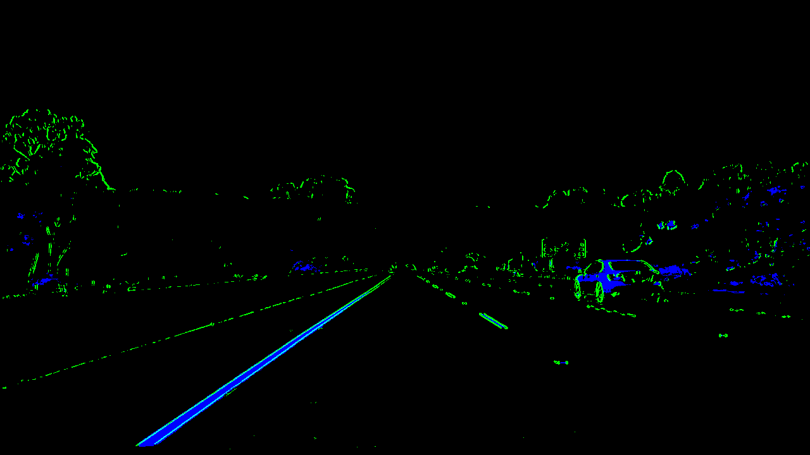
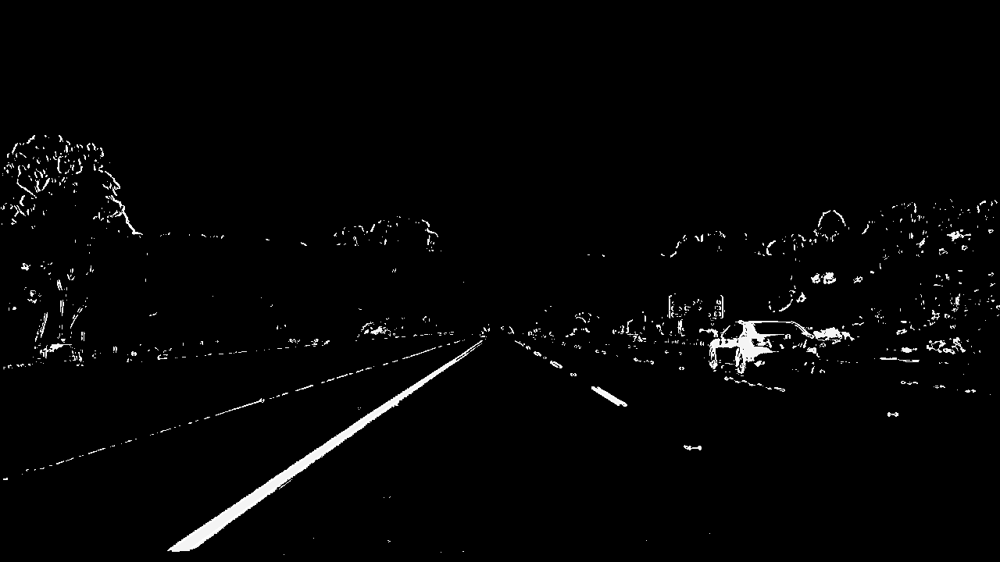

## 5. Perspective transform

Next, we would like to transform our image to a "bird's view" image with equidistant space between lanes, so that
we can properly detect curvature and other interesting characteristics of our road.

This is done using OpenCV in this fashion:
- we first define 4 corners on a symmetric trapezoid the input image that give us a reference
- we define 4 corners in a rectangle corresponding to how our bird's view should look like
- we compute perspective projection matrix
- we transform image using this projection

Now, let's illustrate this in detail:

First, we define 4 corners in the input frame:

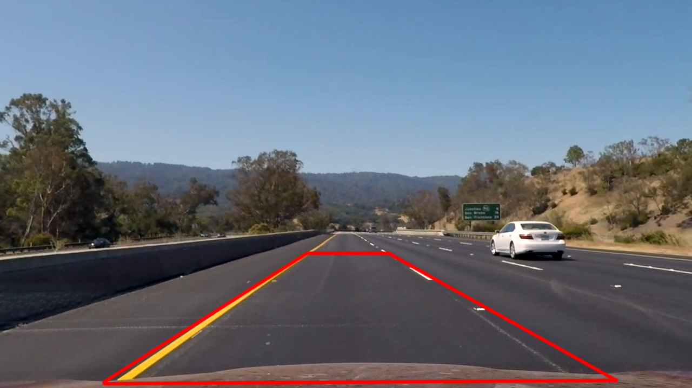 

Then we pick four rectangle corners in the destination bird's view:

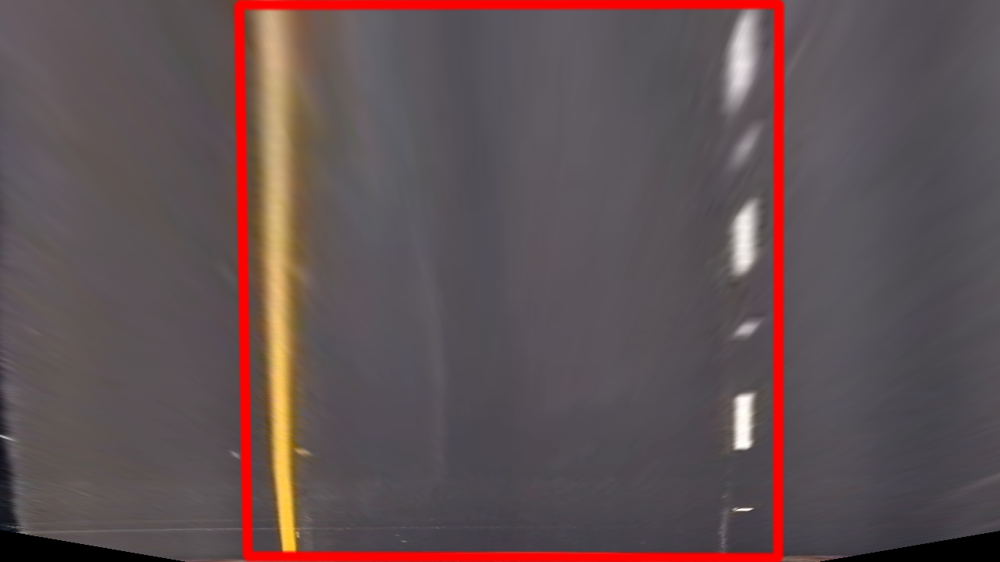

Next, we compute perspective projection transform using OpenCV:

    perspective_transform = cv2.getPerspectiveTransform(source_corners, destination_corners)
    result = cv2.warpPerspective(image, perspective_transform, (image.shape[1], image.shape[0]))

And we end up with the final bird's view image:

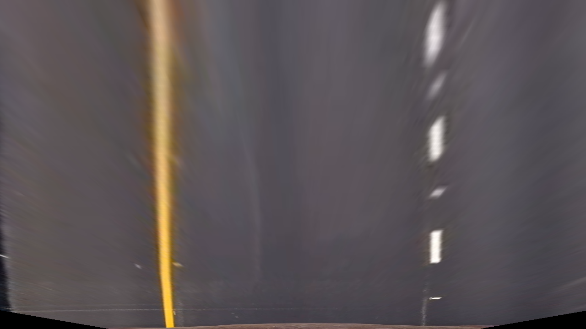

We obviously apply this transform to a combined mask we got from the previous section instead of original frame:

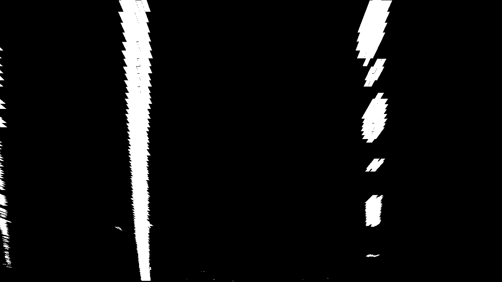

Related code can be found in [camera](camera.py) source file.

## 6. Lanes detection

Now we get to a more complicated part that is about identifying which parts of image are lanes in question.
For driving on a highway Tesla-style, we can assume one lane is on the left and the other on the left to the center
of the image.

We can use image histogram of x-positions of in the image and choose the two highest peaks on each side:  

This is a heuristics, but under our assumptions it should work fine.

Next part is to find the whole extent of both lanes. We can do this by trying to stack windows of equal size
on top of each other clustered around peaks in histogram so that each window shifts only slightly from a previous
position.

There are two components on lane detection:
- detect all windows on a single frame
- continue detecting windows starting from previous result

Obviously, the first component is more computation-intense, as it starts from a blank state, and second
one is very fast as it uses previous detection. Under assumption that camera frame rate is large enough
to allow continuity of frames, we can optimize our algorithm to work as follows:

    find windows from scratch
    while frame available:
        if continuous detection found lanes, return them
        else find windows from scratch

After windows are detected, we fit a quadratic polynomial on Y/X axes using regression to get a fairly accurate
model of each lane:

For methods, look into [lane detection](lane_detection.py) code.

## 7. Curvature and offset

Next, to gather useful information about the turn and car's position, we would like to calculate both estimated
turn radius/curvature as well as offset of the center of the car comparing to the center of the road lane.

We utilize the [curvature formula](http://www.intmath.com/applications-differentiation/8-radius-curvature.php) 
calculation based on average of both left and right polynomial curves we got in the previous step. Before we can
compute, we need to convert the units from pixel-space to object-space.

We assume the width of the road is 3.7m, length of the section in trapezoid 30m and both x- and y-dimensions of our 
pixel-space rectangle are 720.

As for center-offset calculation, we simply take average value of the bottom-most left and right polynomial
and adjust it with the assumption of 3.7m/720px ratio.

Here is an example how we ended up with radius and center offset values:

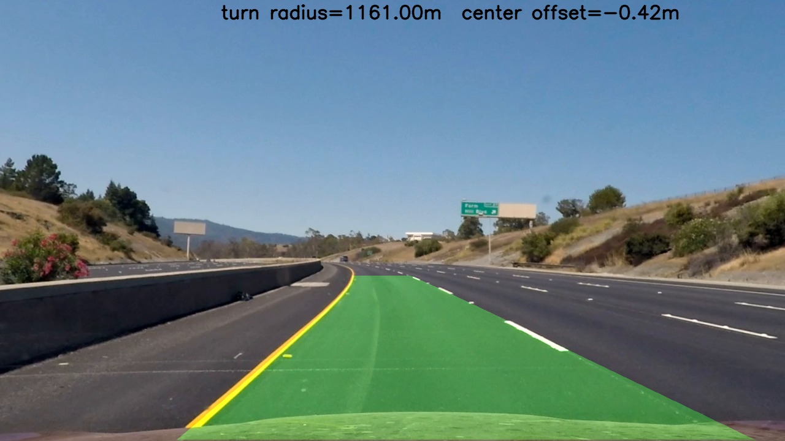

You can also see in the video that these values can change rapidly from frame to frame. Additional smoothening
is performed using weighted average depending on distance from current frame.

Code that does this functionality can be found in [curvature](curvature.py) file.

## 8. Projecting a lane back to image

On the previous image you could have noticed the lane is already highlighted in green. How to do this?

We utilize OpenCV function to get an inverse perspective projection matrix to what we used before:

    inverse_perspective_transform = cv2.getPerspectiveTransform(destination_corners, source_corners)    

We simply fill a polygon with the boundaries of polynomials corresponding to left and right lanes. Notice
the upper part is more distorted; this is to be expected due to not 100% matching of our trapezoid with rectangle
in previous sections:

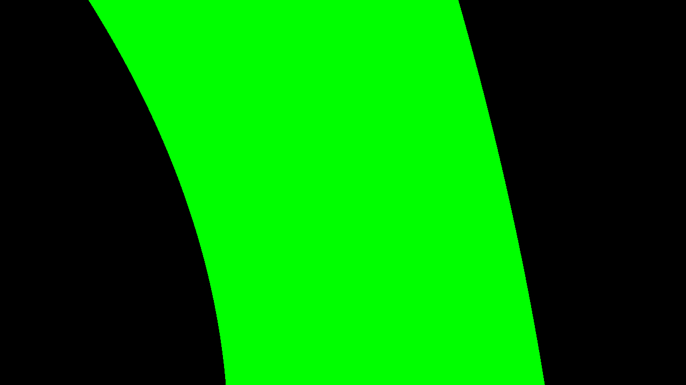

Then we project this image using the inverse perspective projection matrix to our source image.

After projecting, we get the lane nicely fitting our camera view:

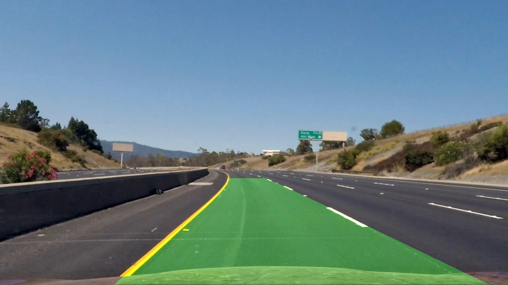

## 9. Result

Here is a resulting video where the whole pipeline described here was applied:
 
[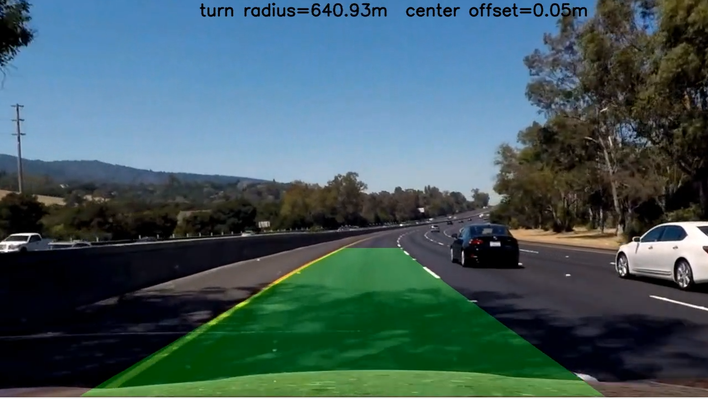](https://raw.githubusercontent.com/squared9/Self-driving-Car/master/Advanced_Lane_Detection/video/lane-output.mp4)

The whole pipeline is implemented in the [main](main.py) source file.

# Improvement ideas and challenges

There are a few challenges to solve:

- different lighting conditions affect S and L channels of HLS color model and one setting won't work in every
 single lighting condition. Perhaps utilizing deep learning to adjust input image to acceptable range
 would help here
- the curvature computation is not perfect; due to projection and the fact that a small variation of distant trapezoid
 positions can cause significant differences frame-by-frame, a more robust method would be preferrable
- detecting lanes using histogram, sliding window or convolution is not flexible when dealing with more complex road 
features and can be often fooled by road surface characteristics, not just paint. More effective way that could handle
intersections, lane merges etc. is needed
- surrounding traffic, especially if dense, can make lane detection fail completely
 
 